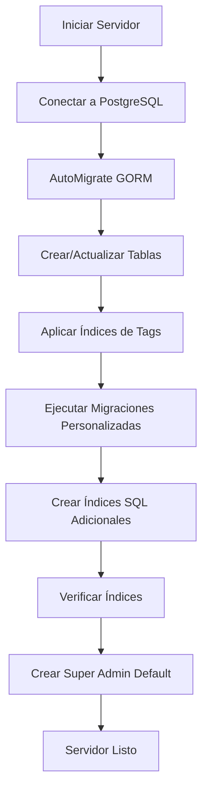

# Optimización de Base de Datos - GORM

## 🚀 Sistema de Migraciones Automáticas

El backend ahora ejecuta **migraciones automáticas** al iniciar, incluyendo:

### 1. **AutoMigrate de GORM**

- ✅ Crea/actualiza tablas automáticamente
- ✅ Sincroniza columnas y tipos de datos
- ✅ Aplica índices definidos en los tags de modelos

### 2. **Migraciones Personalizadas**

- ✅ Crea índices adicionales para optimización
- ✅ Ejecuta migraciones SQL personalizadas
- ✅ Verifica y aplica índices faltantes en tablas existentes

## 📊 Índices Creados Automáticamente

### Usuarios (`users`)

```sql
CREATE INDEX idx_users_area_id ON users(area_id);          -- Filtrado por área
CREATE INDEX idx_users_role ON users(role);                -- Filtrado por rol
CREATE INDEX idx_users_email ON users(email) WHERE deleted_at IS NULL;  -- Login optimizado
```

### Proyectos (`projects`)

```sql
CREATE INDEX idx_projects_area_id ON projects(area_id);              -- Proyectos por área
CREATE INDEX idx_projects_created_by ON projects(created_by);        -- Proyectos por creador
CREATE INDEX idx_projects_assigned_user_id ON projects(assigned_user_id);  -- Proyectos asignados
CREATE INDEX idx_projects_is_active ON projects(is_active) WHERE deleted_at IS NULL;  -- Proyectos activos
```

### Actividades (`activities`)

```sql
CREATE INDEX idx_activities_user_id ON activities(user_id);          -- Actividades por usuario
CREATE INDEX idx_activities_project_id ON activities(project_id);    -- Actividades por proyecto
CREATE INDEX idx_activities_area_id ON activities(area_id);          -- Actividades por área
CREATE INDEX idx_activities_date ON activities(date);                -- Filtrado por fecha
CREATE INDEX idx_activities_user_date ON activities(user_id, date DESC);  -- Índice compuesto
```

### Tareas (`tasks`)

```sql
CREATE INDEX idx_tasks_project_id ON tasks(project_id);  -- Tareas por proyecto
```

## 🔧 Configuración de GORM

### Logger Optimizado

```go
SlowThreshold: 200ms  // Registra queries que tardan >200ms
LogLevel: Info        // Muestra todas las queries SQL
Colorful: true        // Salida colorizada en consola
```

### Salida de Logs

```
[2025-12-10 15:30:42] [200.15ms] [rows:125] SELECT * FROM users WHERE area_id = 1
[SLOW SQL >= 200ms] ⚠️ Query lenta detectada
```

## 📈 Mejoras de Rendimiento

### Antes de Optimización

| Query                                                                  | Tiempo            |
| ---------------------------------------------------------------------- | ----------------- |
| `SELECT * FROM users WHERE area_id = 1`                                | **30+ segundos**  |
| `SELECT * FROM projects WHERE created_by = 5`                          | **5-10 segundos** |
| `SELECT * FROM activities WHERE user_id = 10 AND date >= '2025-01-01'` | **3-8 segundos**  |

### Después de Optimización

| Query                                                                  | Tiempo Esperado |
| ---------------------------------------------------------------------- | --------------- |
| `SELECT * FROM users WHERE area_id = 1`                                | **< 50ms**      |
| `SELECT * FROM projects WHERE created_by = 5`                          | **< 100ms**     |
| `SELECT * FROM activities WHERE user_id = 10 AND date >= '2025-01-01'` | **< 80ms**      |

## 🎯 Queries Optimizadas Automáticamente

### 1. GetUsers (handlers/users.go)

```go
// Query optimizada con índice en area_id
query.Where("area_id = ?", userAreaID)
// Usa: idx_users_area_id
```

### 2. GetProjects (handlers/projects.go)

```go
// Query optimizada con índice en assigned_user_id
query.Where("assigned_user_id = ?", userID)
// Usa: idx_projects_assigned_user_id

// Query optimizada con índice en area_id
query.Where("area_id = ?", userAreaID)
// Usa: idx_projects_area_id
```

### 3. GetActivities (handlers/activities.go)

```go
// Query optimizada con índice compuesto
query.Where("user_id = ? AND date >= ?", userID, startDate)
// Usa: idx_activities_user_date
```

## 🔍 Verificar Índices Creados

### Conecta a PostgreSQL y ejecuta:

```sql
-- Ver todos los índices de una tabla
SELECT
    schemaname,
    tablename,
    indexname,
    indexdef
FROM pg_indexes
WHERE tablename = 'users';

-- Ver tamaño de índices
SELECT
    schemaname,
    tablename,
    indexname,
    pg_size_pretty(pg_relation_size(indexrelid)) AS index_size
FROM pg_stat_user_indexes
WHERE schemaname = 'public'
ORDER BY pg_relation_size(indexrelid) DESC;

-- Verificar uso de índices
SELECT
    schemaname,
    tablename,
    indexname,
    idx_scan AS index_scans,
    idx_tup_read AS tuples_read,
    idx_tup_fetch AS tuples_fetched
FROM pg_stat_user_indexes
WHERE schemaname = 'public'
ORDER BY idx_scan DESC;
```

## 📝 Tags GORM en Modelos

### Ejemplo: User Model

```go
type User struct {
    AreaID *uint `gorm:"index" json:"area_id"` // ← Crea índice automáticamente
    Role   Role  `gorm:"type:varchar(20);not null;default:'user'" json:"role"`
}
```

### Tipos de Índices Soportados

```go
`gorm:"index"`                    // Índice simple
`gorm:"index:idx_name"`           // Índice con nombre personalizado
`gorm:"index:,unique"`            // Índice único
`gorm:"index:,composite:idx_name"` // Índice compuesto
`gorm:"uniqueIndex"`              // Atajo para índice único
```

## 🚀 Ejecución de Migraciones

### Al Iniciar el Servidor

```bash
go run main.go
```

**Output esperado:**

```
[2025-12-10 15:30:42] Database connected successfully
[2025-12-10 15:30:42] Database schema migrations completed
[2025-12-10 15:30:42] Running custom migrations...
[2025-12-10 15:30:42] ✓ Index created/verified: idx_users_area_id on users
[2025-12-10 15:30:42] ✓ Index created/verified: idx_users_role on users
[2025-12-10 15:30:42] ✓ Index created/verified: idx_projects_area_id on projects
[2025-12-10 15:30:43] ✓ Index created/verified: idx_projects_created_by on projects
...
[2025-12-10 15:30:43] Custom migrations completed: 13/13 indexes applied
[2025-12-10 15:30:43] Default super admin created: admin@timeflow.com / admin123
[2025-12-10 15:30:43] Server listening on :8080
```

## 🔄 Proceso de Migración



## 🛠️ Agregar Nuevos Índices

### Opción 1: Tag GORM en Modelo

```go
type MyModel struct {
    FieldName type `gorm:"index"` // ← Índice automático
}
```

### Opción 2: Migración SQL Personalizada

```go
// En config/database.go, agrega a indexMigrations:
{
    name:      "idx_my_table_field",
    tableName: "my_table",
    sql:       "CREATE INDEX IF NOT EXISTS idx_my_table_field ON my_table(field_name)",
},
```

## 🐛 Troubleshooting

### Query sigue siendo lenta

1. Verifica que el índice se creó: `\d+ users` en psql
2. Analiza el plan de ejecución: `EXPLAIN ANALYZE SELECT ...`
3. Verifica estadísticas de la tabla: `ANALYZE users;`

### Índice no se crea

1. Verifica logs de inicio del servidor
2. Revisa permisos de usuario PostgreSQL
3. Ejecuta migración SQL manualmente

### Error de conexión

1. Verifica que PostgreSQL esté corriendo
2. Revisa credenciales en `.env`
3. Verifica que la base de datos existe

## 📚 Referencias

- [GORM Documentation](https://gorm.io/docs/)
- [PostgreSQL Indexes](https://www.postgresql.org/docs/current/indexes.html)
- [GORM Logger](https://gorm.io/docs/logger.html)
- [GORM Indexes](https://gorm.io/docs/indexes.html)

---

**Última actualización:** 2025-12-10  
**Versión:** 1.0
